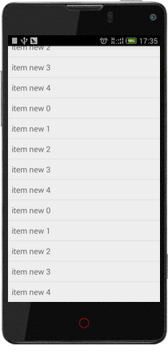

# SimpleLoadMoreListView
Simply pull up to load more datas for ListView

# Features
1.User-defined FooterView<br>
2.Can set linstener to load data thread<br>




# Usages
1.Repalce `ListView` with `com.tom.view.SimpleLoadMoreListView` in your `Layout.xml` file
``` xml
<com.tom.view.SimpleLoadMoreListView
      android:id="@android:id/list"
      android:layout_width="match_parent"
      android:layout_height="wrap_content" 
      />
```
or code
```Java
SimpleLoadMoreListView mListView = new SimpleLoadMoreListView(context);
```
2.Set `SimpleLoadMoreListView.setLoadMoreListener(OnLoadMoreListener loadMoreListener)` for load more datas.</br>
```Java
mListView.setLoadMoreListener(new OnLoadMoreListener() {
			
			@Override
			public void onLoadMore() {
				// Start to get data here
				
			}
		});
```

3.Set `SetSimpleLoadMoreListView.setThreadStatusListener(OnPullThreadStatusListener threadStatusListener)` for 
Linsternning loading data thread.<br>
```Java
mListView.setThreadStatusListener(new OnPullThreadStatusListener() {
			
			@Override
			public boolean pullUPThreadStatusIsAlive() {
				// set your thread status 
				return mThread != null && mThread.isAlive();;
			}
		});
```
4.If do not add `FooterView` on `SimpleLoadMoreListView` ,it is added a default `blank view` as FooterView.
Set `FooterView` visible is `gone` if the thread is finished or load data error.
